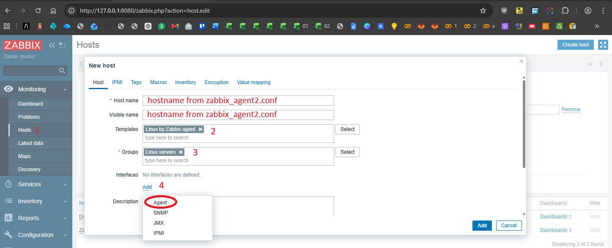
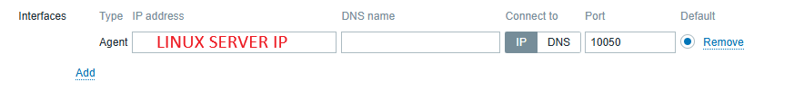
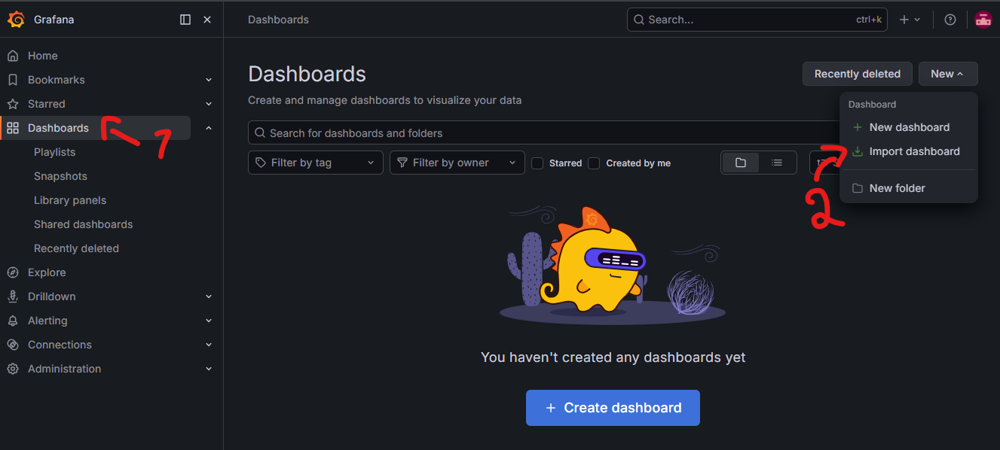
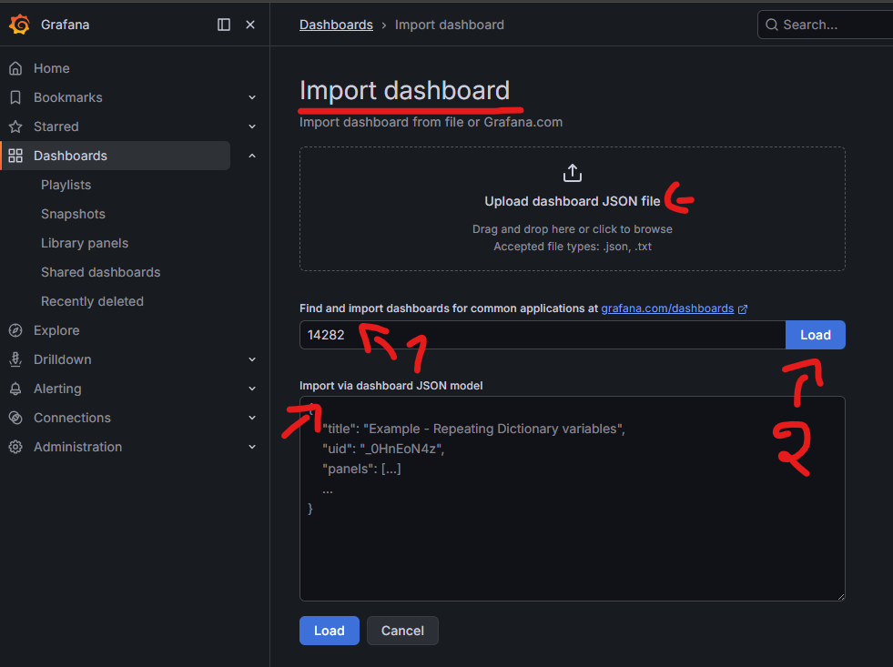
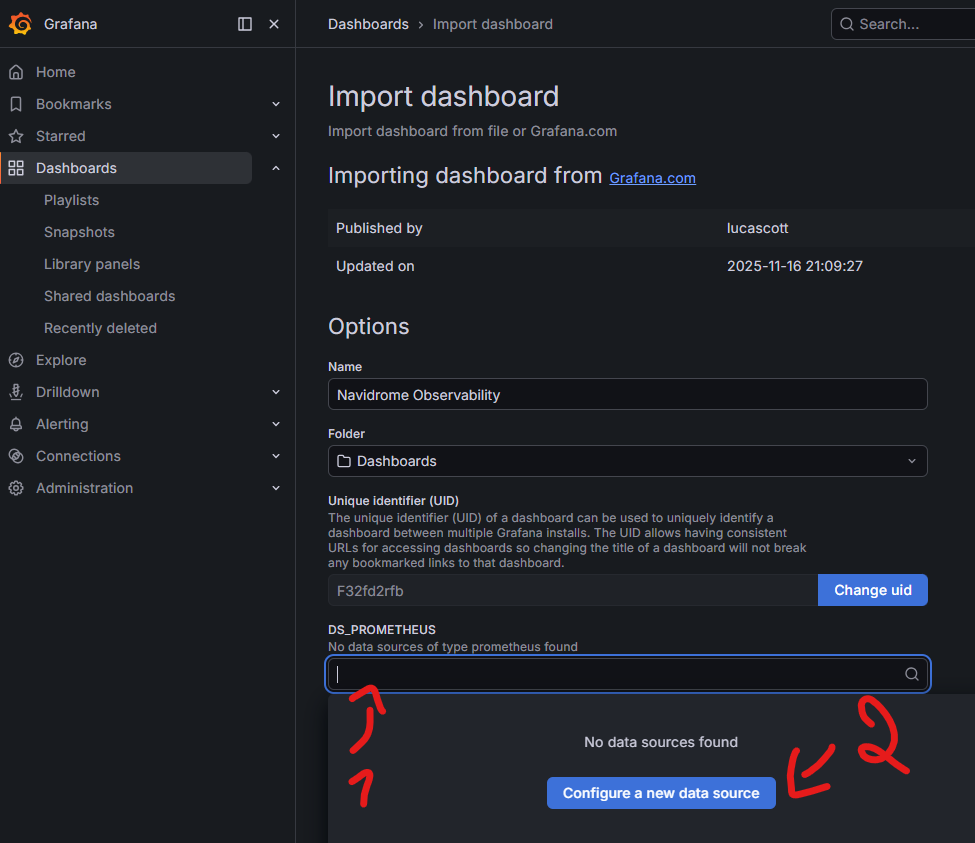
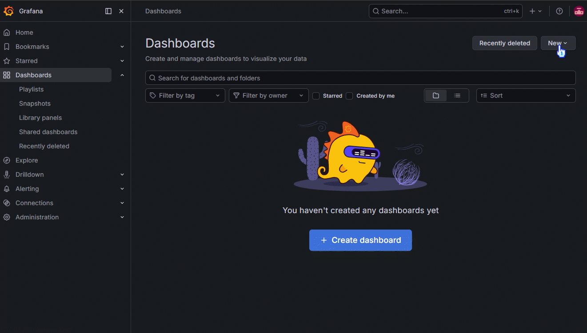

# 🎯 Se ligue, pai - LAB


Este projeto documenta um laboratório de observabilidade ligado a estudos na área de **DevOps** (Desenvolvimento e Operações) e **SRE** (Site Reliability Engineering, ou Engenharia de Confiabilidade de Sites), utilizando uma placa **Raspberry Pi Zero2W** como servidor homelab.

A infraestrutura é composta por uma placa **Raspberry Pi Zero2W** conectada a um **adaptador micro-USB OTG** que por sua vez conecta-se a uma **DockStation** com fonte de alimentação, contendo um **HD SATA 2.5 Slim de 1TB**, responsável por armazenar as mídias utilizadas pelas aplicações self-hosted executadas pelo SO instalado na placa.

A solução integra as ferramentas: **Zabbix** para monitoramento tradicional, **Prometheus** para coleta e armazenamento de métricas em séries temporais, o **Node Exporter** para exportação de métricas do SO (Sistema Operacional), **cAdvisor** para as métricas de containers Docker / Podman e **Grafana** para visualização de tudo isso em dashboards, além de definir alertas.

**OBS.:** É importante destacar que esta não é uma arquitetura ideal para um ambiente de produção. A proposta deste projeto, entretanto, é compreender, de forma 100% prática, os métodos, as tecnologias, suas interações e respectivas limitações, por meio da combinação de ferramentas de **IaC** (Infrastructure as Code), hardware físico e recursos computacionais de baixo consumo energético.

Nesse contexto, a infraestrutura foi projetada para utilizar o mínimo possível de recursos computacionais, explorando também ferramentas e serviços de Cloud em camadas gratuitas (VPN, certificados SSL). Dessa forma, o projeto prioriza o aprendizado prático, a experimentação e a compreensão dos componentes que integram uma infraestrutura moderna, considerando as restrições de custo e de capacidade computacional.

## **A PROPOSTA INICIALMENTE**
## Arquitetura de Observabilidade Zabbix + VPN

```text
        Tailscale VPN (meio de campo)
                     │
     ┌───────────────┴───────────────┐
     │                               │
   Máquina (Cliente)         Máquina (Servidor) Linux
(Container Zabbix Server)     (Agente Zabbix Agent2)
     │                               │
Dashboard Zabbix Web           Coleta métricas
Banco de dados                 CPU, RAM, Disco...
Porta padrão 10051             Porta padrão 10050
```

## Máquina (Cliente) (Container Zabbix Server)

**Máquina (Cliente) (Container Zabbix Server):**
- Zabbix Server
- Frontend Web (Dashboard)
- Banco de dados (PostgreSQL)

**Responsabilidades:**
- Receber dados dos agentes.
- Processar métricas.
- Armazenar histórico.
- Exibir dashboards com essas informações.

---

## Máquina (Servidor) Linux (Agent2)

**Na Máquina (Servidor Linux) roda:**
- Zabbix Agent2

**Responsabilidades:**
- Coletar informações do sistema.
- Responder consultas.
- Enviar métricas (Active Checks).

**Exemplos de métricas:**
- CPU
- Memória
- Disco
- Temperatura
- Rede

---

## Fluxo da comunicação

```text
Máquina (Cliente) (Container Zabbix Server)
        │
        │ Consulta métricas (Passive Checks)
        ▼
Máquina (Servidor) Linux (Zabbix Agent2)

Máquina (Servidor) Linux (Active Checks)
        │
        └────────────► Máquina (Cliente) (Container Zabbix Server) (10051)
```

---

## Resumo

| Dispositivo              | Função        | Porta padrão |
| ------------------------ | ------------- | -----------: |
| Máquina (Cliente)        | Zabbix Server |        10051 |
| Máquina (Servidor) Linux | Zabbix Agent2 |        10050 |

## **ATUALMENTE NO PROJETO**
## Arquitetura de Observabilidade | Zabbix + Prometheus

```
                        Tailscale VPN 
        (meio de campo de comunicação externa segura)
                               │
                ┌──────────────┴──────────────┐
                │                             │
                │                             │
    Maquina de Monitoramento            Máquina Monitorada
            (Cliente)                    (Servidor Linux)    
                │                             │
 ┌──────────────┼──────────────┐      ┌───────┼───────────────────────────┐
 │              │              │      │       │                           │
 │ Zabbix       │ Prometheus   │◄─────┤ Node Exporter (:9100)             │
 │ Server       │              │      │ cAdvisor (:8080)                  │
 │              │              │      │ Zabbix Agent2 (:10050)            │
 │ PostgreSQL   │              │      │                                   │
 │              │              │      │ Docker/Podman (containers)        │        
 │ Grafana      │              │      │ ├── spoty-vella                   │
 │              │              │      │ ├── byteforge-converter           │
 │              │              │      │                                   │
 └──────────────┴──────────────┘      └───────────────────────────────────┘ 
```

## Máquina (Cliente) (Containers: Zabbix, Prometheus, Grafana)

**Na Máquina (Cliente):**
- Zabbix Server (monitoramento, inventário e alertas);
- Zabbix Frontend Web (interface web);
- PostgreSQL (banco de dados do Zabbix) ;
- Prometheus Frontend Web (Coleta e armazena métricas OS/aplicações via Node Exporter e cAdvisor);
- Grafana (dashboards dinâmicos consultando o Prometheus).

**Responsabilidades:**
- Receber métricas do Zabbix Agent2;
- Coletar métricas do Node Exporter;
- Coletar métricas do cAdvisor;
- Armazenar séries temporais no Prometheus;
- Exibir dashboards no Grafana;
- Gerenciar alertas e inventário pelo Zabbix.
---
## Máquina (Servidor) Linux (Agent2)

**Na Máquina (Servidor) Linux:**
- Zabbix Agent2 (Coleta de métricas do sistema pro Zabbix Server)
- Node Exporter (coleta métricas detalhadas do sistema operacional pro Prometheus)
- cAdvisor (coleta métricas dos containers Docker/Podman pro Prometheus)
- Tailscale - (estabelece comunicação segura entre os dispositivos fora da rede doméstica)

**Aplicações monitoradas:**
- spoty-vella (servidor navidrome para streaming de músicas spotify like) (container)
- byteforge-converter (aplicação web ilovePDF like) (container)

**Responsabilidades:**
#### Zabbix Agent2

Monitora a disponibilidade do servidor e coleta métricas tradicionais, como:

- CPU
- Memória
- Disco
- Rede
- Temperatura
- Serviços do sistema

#### Node Exporter

Exporta métricas detalhadas do sistema operacional para o Prometheus:

- CPU
- Memória
- Disco
- Sistema de arquivos
- Rede
- Load Average
- Processos

#### cAdvisor

Exporta métricas dos Containers:

- Uso de CPU por container
- Consumo de memória por container
- I/O de disco por container
- Rede por container
- Estatísticas dos containers
## Fluxo da comunicação

```text
                >>>ZABBIX<<<

Máquina (Cliente) (Containers Zabbix, Prometheus, Grafana)
        │
        │ Consulta métricas (Passive Checks)
        ▼
Máquina (Servidor) Linux (Agent2)

Máquina (Servidor) Linux (Active Checks)
        │
        └────────────► Máquina (Servidor) Linux (10051)


                >>>PROMETHEUS<<<

Máquina (Cliente) (Containers Zabbix, Prometheus, Grafana)
        │
        │ HTTP Scrape
        ▼
Máquina (Servidor) Linux (Node Exporter) (9100)

Máquina (Cliente) (Containers Zabbix, Prometheus, Grafana)
        │
        │ HTTP Scrape
        ▼
Máquina (Servidor) Linux (cAdvisor) (8080)


>>>O GRAFANA FOI INCLUDO NO FLUXO DURANTE A EVOLUÇÃO DO PROJETO<<<

Grafana
        │
        │ Consulta métricas
        ▼
Prometheus

Prometheus
        │
        └────────────► Grafana (Dashboards)
```

## **Arquitetura resumida**

- **Zabbix** → monitoramento tradicional, disponibilidade, inventário e alertas;
- **Prometheus** → coleta e armazenamento de métricas em séries temporais;
- **Node Exporter** → coleta métricas do sistema operacional;
- **cAdvisor** → coleta métricas dos containers Docker/Podman;
- **Grafana** → visualização das métricas armazenadas pelo Prometheus;
- **Tailscale VPN** → comunicação externa e segura entre os dispositivos.

### **PARTE 01 - INSTALAÇÃO DO ZABBIX AGENT2** 
## Instalação do Zabbix agent2 **Na Máquina (Servidor) Linux**
``` bash -y
sudo apt install zabbix-agent2 -y && sudo systemctl enable --now zabbix-agent2 && sudo systemctl status zabbix-agent2
```
## Instalação do Zabbix agent2 **Na Máquina (Servidor) Linux** Se o SO não possuir os repositórios

``` bash
# zabbix 7.4 (última versão estável atual)
wget https://repo.zabbix.com/zabbix/7.4/release/ubuntu/pool/main/z/zabbix-release/zabbix-release_latest_7.4+ubuntu24.04_all.deb && sudo dpkg -i zabbix-release* && sudo apt update && sudo apt install zabbix-agent2 zabbix-agent2
```

```bash
sudo systemctl enable --now zabbix-agent2 && sudo systemctl status zabbix-agent2
```

``` bash
# Zabbix 8.0 LTS (release previsto p/ setembro 2026)
wget https://repo.zabbix.com/zabbix/8.0/release/ubuntu/pool/main/z/zabbix-release/zabbix-release_8.0-0.4%2Bubuntu24.04_all.deb && sudo dpkg -i zabbix-release* && sudo apt update && sudo apt install zabbix-agent2 zabbix-agent2
```

```bash
sudo systemctl enable --now zabbix-agent2 && sudo systemctl status zabbix-agent2
```
### Remover completamente o Zabbix **(caso necessário)**

``` bash
sudo systemctl stop zabbix-agent2
sudo systemctl disable zabbix-agent2
sudo apt purge 'zabbix-agent2*' -y
sudo apt autoremove -y
```
### Verificar e anotar o host-name da **Máquina (Servidor) Linux ** (será importante mais adiante)

**Rode para descobrir o hostname**
``` bash
hostnamectl
```
### Definir as configurações do Zabbix agent2  na **Máquina (Servidor) Linux**
``` bash
sudo nano /etc/zabbix/zabbix_agent2.conf
```
### Configurações do Zabbix agent2 ###

``` bash
############################
# Config base Zabbix-web-ui
############################

# IP da Máquina (Cliente) (Containers Zabbix, Prometheus, Grafana) (responsável pelo monitoramento) para checks passivos
# (o servidor consulta por padrão o agente pela porta 10050)
# Caso altere a porta padrão, use no formato: IP:PORTA
Server=192.168.15.2

# IP do (Cliente) (Containers Zabbix, Prometheus, Grafana) (responsável pelo monitoramento) para checks ativos - crucial para logs
# Caso altere a porta padrão, use no formato: IP:PORTA
ServerActive=192.168.15.2

# hostname da Máquina (Servidor) Linux que roda o agent2. Este mesmo hostname deverá ser o mesmo cadastrado na intercace web do Zabbix.
Hostname=HOSTNAME-DA-MAQUINA
```
## Reiniciar o Zabbix agent2 para aplicar as novas configurações

``` bash
sudo systemctl restart zabbix-agent2 && sudo systemctl status zabbix-agent2
```
## Rodar caso haja problemas na criação de logs ou na própria execução do serviço do Zabbix

``` bash
sudo mkdir -p /var/log/zabbix
sudo chown zabbix:zabbix /var/log/zabbix
sudo chmod 755 /var/log/zabbix
```
### **PARTE 02 - INSTALAÇÃO DA VPN (OPCIONAL PARA ACESSO EXTERNO E SEGURO)**
## Instalação da VPN (TailScale) 1ª Opção

**O processo é o mesmo para a Máquina (Servidor) Linux (Agent2) e para Máquina (Cliente). E caso opte por usar VPN utilize sempre os IPS que ela atribuir às máquinas como identificadores das mesmas.**

**Instalar a última versão do TailScale**
``` bash
curl -fsSL https://tailscale.com/install.sh | sh
```

**Ativar o autostart e em seguida verificar o status do serviço**
``` bash
sudo systemctl enable tailscaled && sudo systemctl status tailscaled
``` 

**Gerar um link de login - Acesse o link gerado através de um dispositivo que tenha acesso a um navegador para autorizar o acesso a uma conta Tailscale**
``` bash
sudo tailscale up
```

**Execute para ver os IPS das máquinas cobertas pela rede da VPN**
``` bash
tailscale status
```

## Instalação da VPN (Netbird) 2ª Opção
###### VPN muito mais customizável e recomendada pra uso de proxy reverso, domínios customizados, suporte a subdomínios ao utilizar domínios customizados, etc.

``` bash
curl -fsSL https://pkgs.netbird.io/install.sh | sh
netbird up & ip addr show wt0 && systemctl status netbird
```

### **PARTE 03 - INSTALAÇÃO DAS FERRAMENTAS DE OBSERVABILIDADE WEB na Máquina (Cliente) (Containers Zabbix, Prometheus, Grafana)**

**Clone este repositório e entre no diretório do projeto**
``` bash
git clone https://github.com/alanmugiwara/se-ligue-pai-lab && cd sex-ligue-pai-lab
```

**Execute o projeto  via Docker/Podman Compose para baixar todas as imagens e subir os containers do Zabbix, Prometheus, Grafana e suas respectivas dependências**
``` bash
docker compose up -d && docker ps
```

``` bash
podman-compose up -d && podman ps
```
## **PARTE  04 - VALIDAÇÕES**

#### Teste de conexão entre endpoints **ZABBIX**

**No servidor Linux (Zabbix Agent2) faça um teste de conexão com o PC (Monitoramento)****
``` bash
sudo apt install netcat-openbsd && nc -zv <IP_DA_MAQUINA_CLIENTE> 10051
```

**Na Máquina (Servidor) Linux (Agent2) validade as configurações de conexão do zabbix agent2**
``` bash
grep -E '^(Server|ServerActive|Hostname|LogFile)' /etc/zabbix/zabbix_agent2.conf
```

**Na Máquina (Cliente) faça um teste de conexão com a Máquina (Servidor) Linux (Agent2)**

``` bash
sudo apt install netcat-openbsd && nc -zv <IP_DA_MAQUINA_SERVIDOR_LINUX_AGENT2> 10050
```
#### Teste de conexão com os jobs **PROMETHEUS**
**Na Máquina (Cliente)** acesse o localhost  **http://localhost:9090/targets** para ver a lista de endpoints alvo ativos e que devem previamente definidos através do `YML` de configuração do Prometheus do nosso projeto, localizado no caminho `se-ligue-pai-lab/src/prometheus/prometheus.yml`
## **PARTE  05 - Instalação dos monitores de logs avançados Node Exporter (para o OS) e cAdvisor (Containers) na Máquina (Servidor) Linux**

#### ** INSTALAR o Node Exporter PARA DOCKER** 
**No servidor linux, execute os comandos abaixo para baixar, extrair, dar permissões de execução e criar um usuário para rodar o Node Exporter**
``` bash
sudo wget --show-progress -O /usr/local/bin/node_exporter.tar.gz https://github.com/prometheus/node_exporter/releases/download/v1.12.1/node_exporter-1.12.1.linux-arm64.tar.gz
sudo tar xvf node_exporter*
sudo mv /usr/local/bin/node_exporter-*/node_exporter /usr/local/bin/node_exporter
sudo chmod +x /usr/local/bin/node_exporter
sudo rm -rf /usr/local/bin/node_exporter-* /usr/local/bin/node_exporter.tar.gz
sudo useradd --no-create-home --shell /usr/sbin/nologin node_exporter && id node_exporter
``

#### ** INSTALAR o Node Exporter para PODMAN** (sem criação de usuário)
**No servidor linux, execute os comandos abaixo para baixar, extrair, dar permissões de execução e criar um usuário para rodar o Node Exporter**
``` bash
sudo wget --show-progress -O /usr/local/bin/node_exporter.tar.gz https://github.com/prometheus/node_exporter/releases/download/v1.12.1/node_exporter-1.12.1.linux-arm64.tar.gz
sudo tar xvf node_exporter*
sudo mv /usr/local/bin/node_exporter-*/node_exporter /usr/local/bin/node_exporter
sudo chmod +x /usr/local/bin/node_exporter
sudo rm -rf /usr/local/bin/node_exporter-* /usr/local/bin/node_exporter.tar.gz
```
#### ** INSTALAR O cAdvisor para DOCKER** 
**No servidor linux, execute os comandos abaixo para baixar, extrair, dar permissões de execução e criar um usuário para rodar o cAdvisor**

``` bash
sudo wget --show-progress -O /usr/local/bin/cadvisor https://github.com/google/cadvisor/releases/download/v0.60.5/cadvisor-v0.60.5-linux-arm64
sudo chmod +x /usr/local/bin/cadvisor
sudo useradd --no-create-home --shell /usr/sbin/nologin cadvisor && id cadvisor
```
#### **INSTALAR O cAdvisor | Para PODMAN (não há criação de usuário)** 
**Na Máquina (Servidor) Linux, execute os comandos abaixo para baixar, extrair, dar permissões de execução e criar um usuário para rodar o cAdvisor**

``` bash
sudo wget --show-progress -O /usr/local/bin/cadvisor https://github.com/google/cadvisor/releases/download/v0.60.5/cadvisor-v0.60.5-linux-arm64
sudo chmod +x /usr/local/bin/cadvisor
```

**Clone este repositório e entre no sub-diretório "monitoring_target"**
``` bash
git clone https://github.com/alanmugiwara/se-ligue-pai-lab && cd se-ligue-pai-lab/src/monitoring_target
```

**PARA DOCKER** - **Mover e habilitar um serviço do node_exporter no systemd**
``` bash
sudo mv node_exporter.service /etc/systemd/system/ && sudo systemctl daemon-reload
sudo systemctl enable node_exporter && sudo systemctl start node_exporter && sudo systemctl status node_exporter
```

**PARA DOCKER** - **Mover e habilitar um serviço do cAdvisor no systemd**
``` bash
sudo mv cadvisor.service /etc/systemd/system/ && sudo systemctl daemon-reload
sudo systemctl enable cadvisor && sudo systemctl start cadvisor && sudo systemctl status cadvisor
```

**PARA PODMAN** - **Mover e habilitar um serviço do node_exporter no systemd**
``` bash
sudo mv node_exporter-rootless.service /etc/systemd/system/ && sudo systemctl daemon-reload
sudo systemctl enable node_exporter-rootless && sudo systemctl start node_exporter-rootless && sudo systemctl status node_exporter-rootless 
```

**PARA PODMAN** - **Mover e habilitar um serviço do cAdvisor no systemd**
``` bash
sudo mv cadvisor-rootless.service /etc/systemd/system/ && sudo systemctl daemon-reload
sudo systemctl enable cadvisor-rootless && sudo systemctl start cadvisor-rootless && sudo systemctl status cadvisor-rootless
```

**Validar permissões**
``` bash
ps -o user,group,pid,cmd -C node_exporter -C cadvisor
```

**PARA DOCKER - Para que o cAdvisor tenha permissão de leitura ao `docker-data` (diretório de trabalho do Docker) rode o seguinte:** Sem isso o **cAdvisor** não consegue coletar métricas do Docker! E atente-se para alterar o caminho até o diretório **"docker-data"** que pode variar conforme o SO.

``` bash
sudo usermod -aG docker cadvisor
sudo systemctl restart cadvisor

sudo groupadd cadvisor-docker
sudo chgrp -R cadvisor-docker /mnt/DIRETORIO_ANTERIOR/docker-data
sudo chmod -R g+rx /mnt/DIRETORIO_ANTERIOR/docker-data
sudo systemctl restart cadvisor && sudo systemctl status cadvisor
```
## **PARTE  06 - Cadastro da Máquina (Servidor) Linux (Agent2) na Máquina (Cliente) (Containers Zabbix, Prometheus, Grafana) para alimentar o Dashboard do Zabbix Web**

**Na Máquina (Cliente), acesse o localhost: http://127.0.0.1:8080/**
**Utilize  os dados de login padrão de Administrador do Zabbix 
user: Admin | password = zabbix**

**É altamente recomendado alterar os dados de acesso após o 1º login!**
**Siga os passos da imagem e preencha os campos conforme o descrito.**


**Basta por o IP do Linux Server a porta, e caso não tenha mudado a porta padrão, basta manter 10050.**



## **PARTE  07 - Cadastro dos monitores de log e utilização de dashboards do Grafana**

1. **O Grafana possui dashboards prontos que podem ser importados pela aplicação web. Após subir o serviço e logar pela interface web, basta seguir os passos abaixo para alimentar a interface com dashbords e assim ser capaz de monitorar servidores, aplicações e serviços.**



2. **Na tela de importação é possível importar um layout de dashboard através de um arquivo `.JSON`, pelo `ID` referenciado na loja oficial do Grafana ou colando o código de um `.JSON`**



3. **Na tela seguinte será necessário definir o data source para concluir a importação. E nesse caso será o `Prometheus`**



4. **Ao definir o data source, devese definir a conexão entre Grafana e Prometheus. Tendo em vista que o projeto utiliza a containers e de acordo com o nosso Docker-compose todos os containers compartilham a mesma rede, apontaremos a rota http://NOME-DO-SERVIÇO-DO-PROMETHEUS:PORTA. E de acordo com o nosso projeto será respectivamente:**
``` bash
   http://prometheus:9090
```



### **A próxima atualização do projeto deverá contemplar a configuração de alertas e notificações para monitoramento de eventos críticos através do Grafana, como uso de disco superior a 85%, utilização de memória RAM acima de 90% e indisponibilidade de servidores, e outros indicadores de desempenho e disponibilidade.**